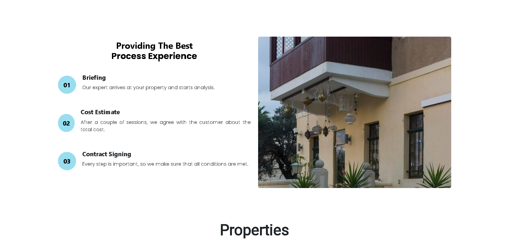

# Real Estate Website Project

This project is a static website designed to showcase properties effectively, delivering a fast, reliable, and visually appealing user experience. Built with simplicity and performance in mind, it is ideal for real estate agencies, property listings, or rental platforms.

## Features
- Lightweight and fast-loading pages.
- Easy to customize and extend for property details.
- SEO-friendly structure to improve visibility.
- Responsive design for seamless viewing on all devices.
- Minimal dependencies for ease .

## How to Use
1. Clone the repository.
2. Customize the content and styles to match your branding.
3. Add property listings and images.
4. Deploy to your preferred hosting platform.

## Tags for Images
- `#real-estate`
- `#property-listing`
- `#responsive-design`
- `#seo-friendly`
- `#web-development`

Feel free to explore and contribute to this project!
## Application Icons

